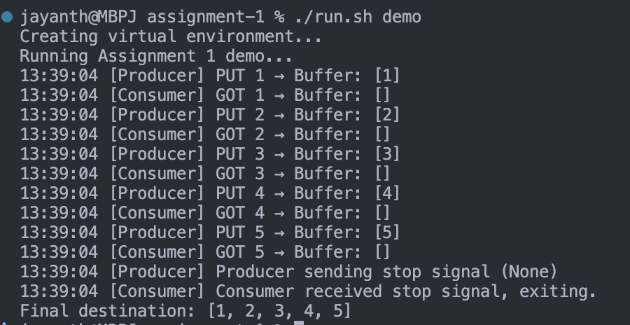
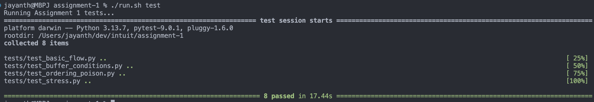

# Assignment 1 – PC-001  
Producer–Consumer Pattern with Thread Synchronization

This assignment implements a classic Producer–Consumer system using Python threads, condition
variables, and a bounded shared buffer. The goal is to demonstrate correct synchronization,
communication between threads, and clean object-oriented design.

---
## 📘 Table of Contents

1. [Approach I Chose](#approach-i-chose)
2. [Other Approaches Considered](#-other-approaches-considered-and-why-i-didnt-choose-them)
3. [Implementation Overview](#implementation-overview)
4. [How to Run](#️-how-to-run)
5. [Output Screenshots](#-output-screenshots)
6. [Test Suite Explanation](#test-suite-explanation)
7. [Assumptions](#assumptions)
8. [Requirements Checklist](#requirements-checklist)
---

## Approach I Chose

I implemented the Producer–Consumer problem using:

- A **bounded shared buffer** backed by `deque` for O(1) enqueue/dequeue  
- Python's `Condition` object for **synchronized put/get** operations  
- Separate `Producer` and `Consumer` thread classes  
- A **poison-pill mechanism** (`None`) for graceful shutdown  
- **Thread-safe containers** supporting multiple producers and consumers
- **Comprehensive error handling** with validation and timeout protection
- Clear, thread-safe logging showing real-time buffer state

This approach ensures correctness, readability, and deterministic behavior under concurrency.

---

## 🔍 Other Approaches Considered (and Why I Didn’t Choose Them)

### **Approach A: Python’s `queue.Queue`**
`queue.Queue` already provides built-in blocking behavior.

**Why I didn’t use it:**
- The assignment specifically tests understanding of synchronization concepts like `Condition`, `wait()`, and `notify_all()`.
- Using `Queue` would hide those mechanisms.
### **Approach B: Using Semaphores Instead of Condition Variables**
A semaphore-based solution is possible.

**Why not:**
- Semaphores alone make it harder to keep buffer access strictly synchronized.
- Condition variables provide clearer producer/consumer semantics.

**Conclusion:**  
The chosen design has the best balance between correctness, clarity, and meeting assignment requirements.

**Selected approach demonstrates explicit control over concurrency** via condition variables, matching the assignment’s intent.

tradeoffs - harder to maintain, more manual logic and error-prone

---

## 🧱 Implementation Overview

### **File Structure**

```
assignment-1/
│
├── src/
│ ├── container.py          # Thread-safe source + destination
│ ├── producer.py           # Producer thread with error handling
│ ├── consumer.py           # Consumer thread with poison pill passing
│ ├── shared_buffer.py      # Bounded buffer with wait/notify
│ └── main.py               # Demo runner (single + multi-threaded demos)
│
├── tests/
│ ├── test_basic_flow.py               # Basic correctness tests
│ ├── test_buffer_conditions.py        # Edge case tests
│ ├── test_ordering_poison.py          # FIFO and termination tests
│ ├── test_stress.py                   # Stress tests
│ └── test_multi_producer_consumer.py  # Multi-threading tests (NEW)
│
└── run.sh                  # Script to run demo or tests
```

### **Key Components**

#### +`SharedBuffer`
Implements a bounded buffer with:

- Internal `deque`
- `put()` blocking when full  
- `get()` blocking when empty  
- `Condition` for producer/consumer coordination  
- `snapshot()` for debug-friendly buffer visualization
- **Input validation** (max_size must be positive integer)
- **Thread-safe** for multiple producers and consumers

#### + `SourceContainer` & `DestinationContainer`
- **Thread-safe** with `Lock` protection for concurrent access
- `SourceContainer`: Multiple producers can safely share the same source
- `DestinationContainer`: Multiple consumers can safely write to same destination
- O(1) operations using `deque` for efficient concurrent access

#### + `Producer`
- Reads from `SourceContainer` (thread-safe)
- Calls `buffer.put(item)`
- Logs every step with buffer state
- Sends `None` as a poison pill on completion
- **Error handling**: Validates objects, catches exceptions, timeout protection

#### + `Consumer`
- Reads using `buffer.get()`
- Stores values in `DestinationContainer` (thread-safe)
- **Poison pill passing**: Puts pill back for other consumers before exiting
- Stops cleanly on receiving `None`
- **Error handling**: Validates objects, catches exceptions

#### + `main.py`
Runs a full example with 5 items and prints final results.

### Wait/Notify Mechanism
- **Producer waiting:** If the buffer is full, the producer calls `condition.wait()` and releases the lock.
- **Consumer notification:** After consuming an item, the consumer calls `condition.notify_all()` to wake sleeping producers.
- **Consumer waiting:** If the buffer is empty, the consumer calls `condition.wait()` and releases the lock.
- **Producer notification:** After producing an item, the producer calls `condition.notify_all()` to wake sleeping consumers.

#### Note:
Why I used `deque` instead of `queue.Queue` or a `list`:

- `deque` gives O(1) append/pop operations and allows explicit control over synchronization, which the assignment requires.

- `queue.Queue` is already synchronized internally, so using it would hide the wait/notify logic and defeat the purpose of demonstrating thread coordination manually.

---
## ▶️ How to Run
```bash
cd assignment-1 
./run.sh demo      # Run concurrency demo (single + multi-threaded)
./run.sh test      # Run all unit tests
./run.sh clean     # Clean environment
```
The script automatically creates a virtual environment and installs dependencies.

### Demo Modes

1. **Single Producer-Consumer**: Original demo with 1 producer + 1 consumer
2. **Multi Producer-Consumer**: NEW demo with 2 producers + 2 consumers showing concurrent operation

---

## 📸 Output Screenshots

### **Demo**
```
Running Assignment 1 demo...
13:39:04 [Producer] PUT 1 → Buffer: [1]
13:39:04 [Consumer] GOT 1 → Buffer: []
13:39:04 [Producer] PUT 2 → Buffer: [2]
13:39:04 [Consumer] GOT 2 → Buffer: []
13:39:04 [Producer] PUT 3 → Buffer: [3]
13:39:04 [Consumer] GOT 3 → Buffer: []
13:39:04 [Producer] PUT 4 → Buffer: [4]
13:39:04 [Consumer] GOT 4 → Buffer: []
13:39:04 [Producer] PUT 5 → Buffer: [5]
13:39:04 [Consumer] GOT 5 → Buffer: []
13:39:04 [Producer] Producer sending stop signal (None)
13:39:04 [Consumer] Consumer received stop signal, exiting.
Final destination: [1, 2, 3, 4, 5]
```



### **Tests**
```
Running Assignment 1 tests...
=========================================== test session starts ===========================================
platform darwin -- Python 3.13.7, pytest-9.0.1, pluggy-1.6.0
rootdir: assignment-1
collected 8 items

tests/test_basic_flow.py ........
tests/test_buffer_conditions.py ..
tests/test_ordering_poison.py ...
tests/test_stress.py ...

============================================ 8 passed in 17.44s ============================================
```
  

---
## Test Suite Explanation

The test suite covers **every critical correctness dimension**:

### ✔ Basic Flow Tests (`test_basic_flow.py`)
- All items transferred in order  
- Handles empty sources correctly  

### ✔ Buffer Condition Tests (`test_buffer_conditions.py`)
- Behavior when buffer size = 1  
- Behavior when buffer > dataset size  

### ✔ Ordering + Poison Pill (`test_ordering_poison.py`)
- Ensures FIFO correctness  
- Ensures `None` is **not** stored in destination  

### ✔ Stress Tests (`test_stress.py`)
- 300-item workload  
- Random producer/consumer jitter to mimic real concurrency  
- Verifies system is stable under timing variability

### ✔ Multi-Producer Multi-Consumer Tests (`test_multi_producer_consumer.py`) **NEW**
- **2 producers + 2 consumers**: Balanced load distribution
- **3 producers + 1 consumer**: Producer competition for items
- **1 producer + 3 consumers**: Consumer load balancing
- **Asymmetric ratios**: 4:2 and 2:4 configurations
- **Large scale**: 10 producers + 10 consumers with 500 items
- **Validates**: No data loss, no duplicates, all threads terminate cleanly

The coverage demonstrates correctness under normal, edge, stress, and multi-threaded conditions.

---

## Assumptions

1. **Multi-Consumer Support**: Each producer sends one poison pill when done. Consumers pass poison pills along to other consumers before exiting, ensuring all consumers terminate.
2. **Thread Safety**: Containers use locks for thread-safe access by multiple producers/consumers.
3. `SourceContainer` supplies items in FIFO order using `deque`.  
4. Buffer capacity is fixed at initialization.  
5. Logging is for demonstration and not required in production.
6. **Error Handling**: Includes input validation, timeout protection (30s), and graceful failure modes.  

---

## Requirements Checklist

| Requirement | Notes |
|------------|-------|
| Thread synchronization | Using `Condition` wait/notify |
| Concurrent programming |  Producer + Consumer threads |
| Blocking queues |  Bounded buffer with blocking put/get |
| Wait/Notify mechanism |Explicit `condition.wait()` + `condition.notify_all()` |
| Demonstrates concurrency |  Logs show buffer state in real time |
| Clean architecture |  Separate classes, modular design |
| Unit tests | Complete pytest suite (14 tests total) |
| Multi-threading support | N producers + M consumers (thread-safe) |
| Error handling | Input validation, timeouts, exception handling |
| Scalability | Tested up to 10+10 threads with 500 items |
| Performance | O(1) operations with minimal lock contention |

---


