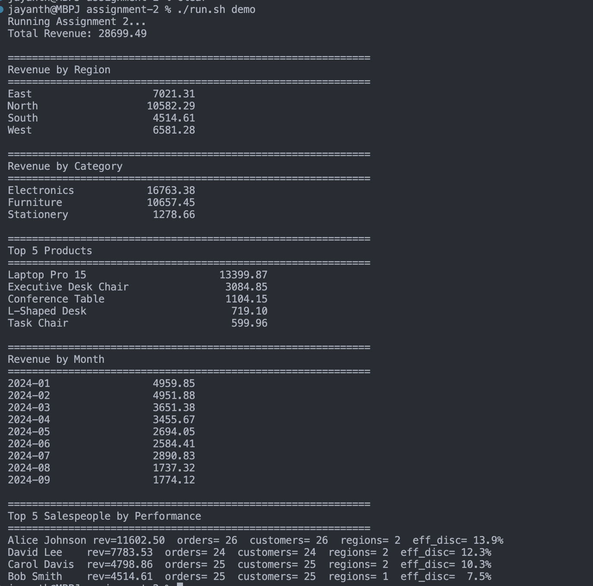
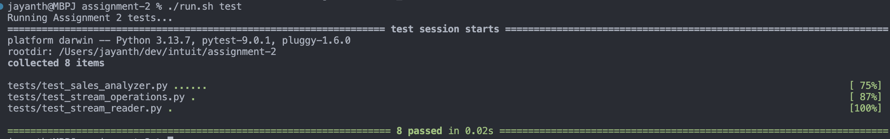

# Assignment 2 – Sales Data Analysis (SA-001)

This assignment implements a functional-programming–based data analysis pipeline for sales transactions. 

The solution reads a semi-realistic CSV dataset, converts each row into structured objects, and performs multiple analytical queries using pure FP constructs such as `map`, `filter`, `reduce`, `sorted`, and `groupby`.

---
## Contents

1. [Chosen Approach](#chosen-approach)
2. [Dataset Description](#dataset-description)
3. [Implementation Structure](#implementation-structure)
4. [Running Setup](#running-setup)
5. [Example Outputs](#example-outputs)
6. [Test Cases Explanation](#test-cases-explanation)
7. [Assumptions](#assumptions)
8. [Requirements Checklist](#-requirements-checklist)
---

## Chosen Approach

I implemented this assignment using:

### **1. Functional Programming Pipelines**
The analysis functions rely on:

- `map()`, `filter()`, `reduce()`
- `sorted()` with custom key functions
- `itertools.groupby`
- Lambda-based transformations and aggregations

Each operation produces new derived results without mutating shared state.

---

### **2. Strong Data Modeling With `SalesRecord`**
Every CSV row is converted into a `SalesRecord` dataclass, providing:

- Automatic field validation
- Computed properties (`amount`, `full_price_revenue`, `discount_amount`)
- Clean, testable business logic

---

### **3. A Dedicated Analyzer Module**
All analysis logic is placed inside `src/analyzer.py`, implementing:

- Total revenue
- Revenue by region
- Revenue by category
- Revenue by month
- Top-N products
- Salesperson performance summary

---

### **4. A Clean Reporting Layer**
`src/reporting.py` formats output into readable CLI tables:

- Key-value summaries  
- Product rankings  
- Salesperson performance tables

---

### **5. Comprehensive Error Handling** ✨ NEW
- **Input validation**: File existence, required fields, type checking
- **Data validation**: Range checks (quantity ≥ 0, 0 ≤ discount ≤ 1, price ≥  0)
- **Graceful failures**: Clear error messages with context (row numbers, field names)
- **Logging**: INFO, ERROR, and CRITICAL levels for monitoring
- **Type safety**: Validates CSV parsing and conversion errors  

---

## Dataset Description

The dataset is located at:
`assignment-2/data/sales_data.csv`


It is a **semi-realistic synthetic dataset** containing typical retail sales information.

| Column        | Meaning                                 |
|---------------|------------------------------------------|
| `order_id`    | Unique sales line ID                     |
| `date`        | Transaction date (ISO 8601)              |
| `customer_id` | Unique customer identifier               |
| `product_id`  | Product SKU / code                       |
| `product_name`| Human-readable product name              |
| `category`    | Product category                         |
| `quantity`    | Units sold                               |
| `unit_price`  | Original price before discount           |
| `discount`    | Discount percentage (0.0–1.0)            |
| `region`      | Sales region (e.g., East, West, EU)      |
| `salesperson` | Employee handling the sale               |

Its structure supports meaningful aggregation patterns such as monthly revenue, category analysis, and salesperson performance.

---

## Implementation Structure
```
assignment-2/
│
├── src/
│ ├── analyzer.py     # Core FP analysis functions with validation
│ ├── load_csv.py     # Functional CSV loader with error handling
│ ├── model.py        # SalesRecord dataclass with computed fields
│ ├── reporting.py    # Pretty-print helpers with type validation
│ └── main.py         # CLI report runner with comprehensive error handling
│
├── tests/            # Pytest suite covering all modules
└── data/             # Input CSV
```

### **Key Implementation Highlights**

#### + `load_csv.py`
- Pure FP row-to-object conversion  
- No mutation or side effects  
- Returns typed `SalesRecord` instances
- **Error handling**: File validation, missing field detection, type conversion errors
- **Data validation**: Range checks on quantity, price, discount

#### + `analyzer.py`
Implements analysis using FP constructs:

- `reduce()` for product revenue aggregation  
- `groupby()` for region/category/month analysis  
- `sorted()` for ordering values  
- Zero global state
- **Input validation**: Empty records check, parameter validation (n > 0)

#### + `reporting.py`
Formats raw analysis outputs into readable tables.
- **Type validation**: Checks for dict, iterable types
- **Graceful formatting**: Handles formatting errors without crashing

#### + `main.py`
Coordinates the workflow:

1. Loads dataset with file existence validation
2. Runs all analysis functions with error handling
3. Prints summaries
4. **Error handling**: Try-catch blocks around each analysis, proper exit codes  

---

## Running Setup

```
cd assignment-2
./run.sh run # Run sales analyzer report
./run.sh test # Run unit tests
```
The script automatically creates a virtual environment and installs dependencies.

---
## Example Outputs
### **Demo**
  ```
Running Assignment 2...
Total Revenue: 28699.49

============================================================
Revenue by Region
East 7021.31
North 10582.29
South 4514.61
West 6581.28

============================================================
Revenue by Category
Electronics 16763.38
Furniture 10657.45
Stationery 1278.66

============================================================
Top 5 Products
Laptop Pro 15 13399.87
Executive Desk Chair 3084.85
Conference Table 1104.15
L-Shaped Desk 719.10
Task Chair 599.96

============================================================
Revenue by Month
2024-01 4959.85
2024-02 4951.88
2024-03 3651.38
2024-04 3455.67
2024-05 2694.05
2024-06 2584.41
2024-07 2890.83
2024-08 1737.32
2024-09 1774.12

============================================================
Top 5 Salespeople by Performance
Alice Johnson rev=11602.50 orders=26 customers=26 regions=2 eff_disc=13.9%
David Lee rev=7783.53 orders=24 customers=24 regions=2 eff_disc=12.3%
Carol Davis rev=4798.86 orders=25 customers=25 regions=2 eff_disc=10.3%
Bob Smith rev=4514.61 orders=25 customers=25 regions=1 eff_disc=7.5%
```

  

### **Tests**
```
Running Assignment 2 tests...
=========================================== test session starts ===========================================
platform darwin -- Python 3.13.7, pytest-9.0.1, pluggy-1.6.0
rootdir: assignment-2
collected 8 items

tests/test_sales_analyzer.py ......
tests/test_stream_operations.py ...
tests/test_stream_reader.py ......

============================================ 8 passed in 0.02s ============================================
```
  

---

## Test Cases Explanation
 All test cases in this test suite use `temporary sample data` that is generated in each test case.

### ✔ Analyzer correctness
- Total revenue  
- Revenue by region  
- Revenue by category  
- Revenue by month  
- Product ranking (Top-N)  
- Salesperson performance statistics  

### ✔ Stream operation behavior
- Functional pipelines using `map → filter → sort`

### ✔ CSV loader correctness
- Proper row parsing  
- Accurate numeric type conversion  
- Correct quantity, discount, and price handling  

The test coverage is complete and aligns fully with assignment requirements.

---

## Assumptions

- Dataset uses valid ISO 8601 dates  
- Discount values are in the range 0.0–1.0 (validated during loading)
- Rows are well-formed with all required fields (validated during loading)
- Month extraction uses `YYYY-MM` format  
- Salesperson performance is computed per line item
- **Error Handling**: Invalid data raises clear errors with row context
- **File Encoding**: CSV uses UTF-8 encoding  

---

## ✔ Requirements Checklist

| Requirement | Notes   |
|------------------------|--------------------------------------------------|
| Functional programming | Uses reduce, lambdas, groupby, map/filter        |
| Stream operations      | FP pipelines & sorted/grouped transformations    |
| Data aggregation       |Multi-level analysis implemented                 |
| Works on CSV input     | Functional DictReader → dataclass pipeline       |
| Unit tests             | All analysis functions thoroughly tested         |
| Console printing       | Summaries + formatted reports                    |
| Clear code organization| Modular, maintainable, and fully separated       |
| **Error handling** ✨    | **Input validation, type checking, graceful failures** |
| **Data validation** ✨   | **Range checks, required fields, type conversion** |
| **Logging** ✨           | **INFO/ERROR/CRITICAL levels with context**        |

---

## 🛡️ Error Handling Features

### File-Level Validation
- ✅ File existence check before loading
- ✅ Permission validation
- ✅ UTF-8 encoding error handling
- ✅ CSV format validation (headers, structure)

### Row-Level Validation
- ✅ Required field presence check
- ✅ Type conversion with error context (shows row number)
- ✅ Range validation:
  - Quantity cannot be negative
  - Unit price cannot be negative  
  - Discount must be between 0 and 1

### Analysis-Level Validation
- ✅ Empty dataset detection
- ✅ Parameter validation (n must be positive integer)
- ✅ Type checking for inputs

### Graceful Failure
- ✅ Clear error messages with context
- ✅ Proper exit codes (0 for success, 1 for failure)
- ✅ Logging at appropriate levels
- ✅ No silent failures
